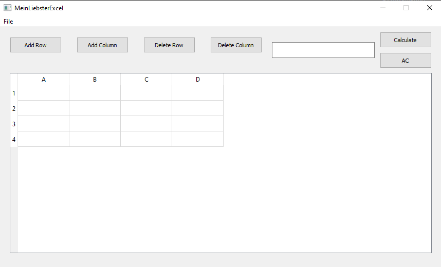

<H3>Цей додаток був створений задовго до появи оригінального Excel!</H3> 
Тут можна виконати такі дії:

1. У лініїї введення:  
    a) Додавання  +  
    b) Віднімання   -  
    b) Множення  *  
    c) Ділення  /  
    d) Піднесення до степеня  ^  
    e) Знаходження максимального та мінімального серед двох значень  min / max  
    f) Підтримуються унарні операціі     

2. У комірках, за умови, що перед виразом є =:  
Приклад 1: =B2 + 3  
   a) Всі операії перераховані у першому пункті  
   b) Внесення у клітинку значення іншої клітинки, за умови, що перед виразом є #    
Приклад 2: #B3   

3. Відкрити існуючий файл з розширенням xlsx або xls 
4. Зберігти таблицю у файл з розширенням xlsx або xls 
5. Очистити всю таблицю

<H2>
Фінальний вигляд</H2>
